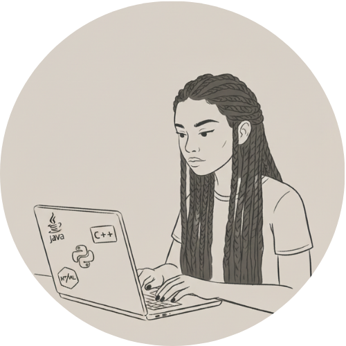

  <h1 align="center">Hi everyone, I'm! ☕</h1>
  

    <em>Computer Science Undergraduate at UFJF</em>
  

---

 
  
  

   I’m an 19-year-old woman driven by <strong>continuous learning and problem-solving</strong>. Here you’ll find my projects and experiments as I grow in <strong>software engineering</strong>.   Feel free to contact me by clicking <a href="mailto:souzad.isadora@gmail.com">here!</a>
  

  
  
  
  
  
  

---

  <em>
  “The more I study, the more insatiable do I feel my genius for it to be.” —<strong>Ada Lovelace</strong>
  </em>

